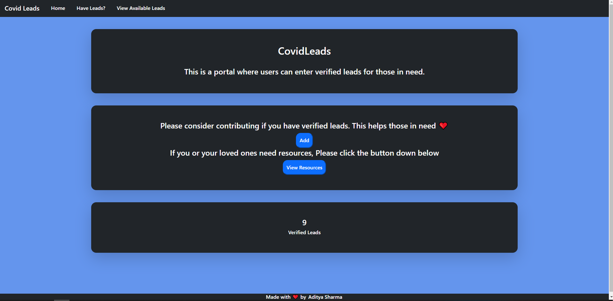
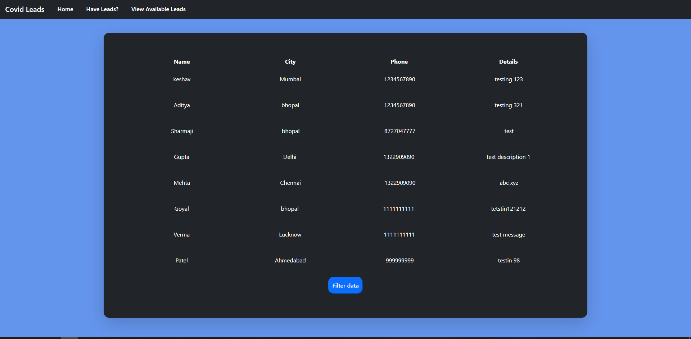
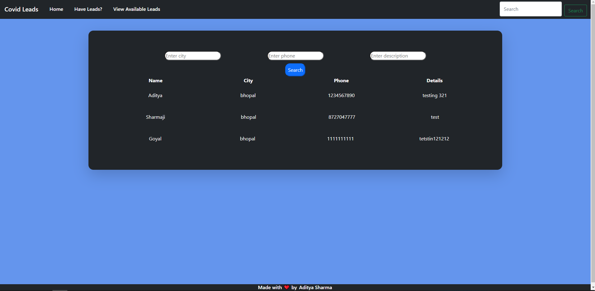

## CovidLeads
Website for available Covid 19 resources and leads made using PHP and connected to MySQL database.

### Features
- Allows users who have reources to post about them
- These posts are stored in MySQL database.
- Users in need can visit our `view available sources` page.
- From there, to make things simpler, a filter function is also available to filer by cities or phone number.

### Sample Photos:
<figcaption>Home page</figcaption> 

<figcaption>View Leads page</figcaption> 

<figcaption>Filter Leads page</figcaption> 

